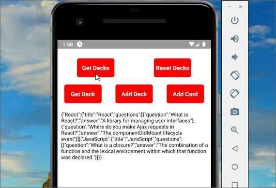
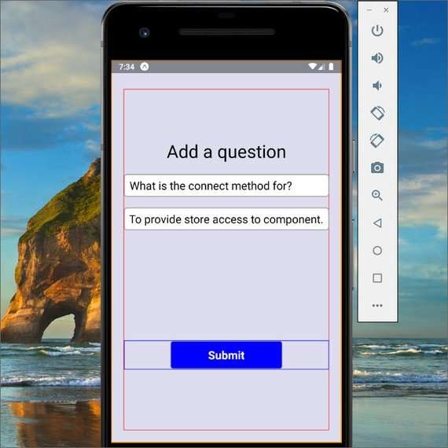

<!-- markdownlint-disable MD022 MD024 MD032 MD033 -->
# Code Notes

This site contains code notes for project 3 of my Udacity React Nanodegree project. Click the link below for more information on the course.
- [Udacity's React Nanodegree Program](https://www.udacity.com/course/react-nanodegree--nd019)

[](assets/images/mfc2.jpg)<br>
<span class="center bold">App Mockup</span>

---

## 1. Project Requirements
### 1.1 Overview
The assignment is to build a mobile flashcard app from scratch using React Native.

There is no starter code and below is the link to the rubric.

- [Mobile Flashcard Project Specification](https://review.udacity.com/#!/rubrics/1021/view)

### 1.2 Specific Requirements
Here are the high-level requirements for this app.

- Use [expo-cli](https://docs.expo.io/versions/v32.0.0/introduction/installation/) to build the project.
- Allow users to create a deck which can hold an unlimited number of cards.
- Allow users to add a card to a specific deck.
- The front of the card should display the question.
- The back of the card should display the answer.
- Users should be able to quiz themselves on a specific deck and receive a score once they're done.
- Users should receive a notification to remind themselves to study if they haven't already for that day.

### 1.3 Views
The application should have five views. The Quiz View should change based on the data.

[](assets/images/mfc1.jpg)<br>
<span class="center bold">Views</span>

Here are the views needed for this app.

1. DeckList
2. AddDeck
3. Deck (Individual)
4. AddCard
5. Quiz
   - Front (Question)
   - Back (Answer)
   - Results (Upon completion)

#### 1.3.1 DeckList View (Default)

- displays the title of each Deck
- displays the number of cards in each deck

#### 1.3.2 AddDeck View

- An option to enter in the title for the new deck
- An option to submit the new deck title

#### 1.3.3 Deck View

- displays the title of the Deck
- displays the number of cards in the deck
- displays an option to start a quiz on this specific deck
- An option to add a new question to the deck

#### 1.3.4 AddCard View

- An option to enter in the question
- An option to enter in the answer
- An option to submit the new question

#### 1.3.5 Quiz View

- displays a card question
- an option to view the answer (flips the card)
- a "Correct" button
- an "Incorrect" button
- the number of cards left in the quiz
- Displays the percentage correct once the quiz is complete

### 1.4 Data
We'll use Expo's `AsyncStorage` to store our decks and flashcards. Redux is optional for this project but we'll use it nonetheless.

Using AsyncStorage we'll manage an object whose shape is similar to this:

```js
{
  React: {
    title: 'React',
    questions: [
      {
        question: 'What is React?',
        answer: 'A library for managing user interfaces'
      },
      {
        question: 'Where do you make Ajax requests in React?',
        answer: 'The componentDidMount lifecycle event'
      }
    ]
  },
  JavaScript: {
    title: 'JavaScript',
    questions: [
      {
        question: 'What is a closure?',
        answer: 'The combination of a function and the lexical environment
          within which that function was declared.'
      }
    ]
  }
}
```

Effects of app on the data.

- Each deck creates a new key on the object.
- Each deck has a `title` and a `questions` key.
- `title` is the title for the specific deck
- `questions` is an array of questions and answers for that deck.

### 1.5 Helper Methods
To manage your AsyncStorage database, you'll want to create four different helper methods.

- `getDecks`: return all of the decks along with their titles, questions, and answers.
- `getDeck`: take in a single id argument and return the deck associated with that id.
- `saveDeckTitle`: take in a single title argument and add it to the decks.
- `addCardToDeck`: take in two arguments, title and card, and will add the card to the list of questions for the deck with the associated title.

#### 1.5.1 UI to Test API Methods
I created the API methods and a UI to test with.

[](assets/images/mfc3.jpg)<br>
<span class="center bold">API Tests</span>

The methods are located in 'utils/api.js'

```js
import { AsyncStorage } from 'react-native';
import { decks } from './_DATA';

const DECKS_STORAGE_KEY = 'MobileFlashcards:decks';

export async function getDecks() {
  try {
    const storeResults = await AsyncStorage.getItem(DECKS_STORAGE_KEY);

    if (storeResults === null) {
      AsyncStorage.setItem(DECKS_STORAGE_KEY, JSON.stringify(decks));
    }

    return storeResults === null ? desks : JSON.parse(storeResults);
  } catch (err) {
    console.log(err);
  }
}

export async function getDeck(id) {
  try {
    const storeResults = await AsyncStorage.getItem(DECKS_STORAGE_KEY);

    return JSON.parse(storeResults)[id];
  } catch (err) {
    console.log(err);
  }
}

export async function saveDeckTitle(title) {
  try {
    await AsyncStorage.mergeItem(
      DECKS_STORAGE_KEY,
      JSON.stringify({
        [title]: {
          title,
          questions: []
        }
      })
    );
  } catch (err) {
    console.log(err);
  }
}

export async function addCardToDeck(title, card) {
  try {
    const deck = await getDeck(title);

    await AsyncStorage.mergeItem(
      DECKS_STORAGE_KEY,
      JSON.stringify({
        [title]: {
          questions: [...deck.questions].concat(card)
        }
      })
    );
  } catch (err) {
    console.log(err);
  }
}

export async function resetDecks() {
  try {
    await AsyncStorage.removeItem(DECKS_STORAGE_KEY);
  } catch (err) {
    console.log(err);
  }
}
```

The methods can then be tested by clicking each button.

[](assets/images/mfc4.jpg)<br>
<span class="center bold">API Tests</span>

## 2. Views
Here are screenshots of the initial views.

### 2.1 DeckList

[](assets/images/mfc5.jpg)<br>
<span class="center bold">DeckList View</span>

This view contains multiple instances of the Deck component.

### 2.2 AddDeck

[](assets/images/mfc6.jpg)<br>
<span class="center bold">AddDeck View</span>

### 2.3 DeckDetail

[](assets/images/mfc7.jpg)<br>
<span class="center bold">DeckDetail View</span>

<!-- ### 2.4 AddCard

[](assets/images/mfc8.jpg)<br>
<span class="center bold">AddCard View</span> -->
